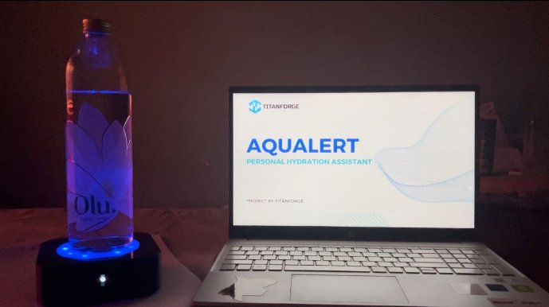

# **AQUALERT**
 

AQUALERT is a compact electronic device which can accommodate any type of water bottle. The device will act as a platform for the bottle of the user to be kept on. It will take readings of the amount of water consumed by the user and offer reminders if the user forgets to drink the required amount of water inside a defined period of time.

## SYSTEM ARCHITECTURE 
 

## **POWER SUPPLY**
The power supply consists of TP4056 Lithium Battery Charging Module, which gets it power from USB input, a 1800mAh Li- ion battery and MT3608 DC-DC Step Up Boost convertor.

## **SENSORS**
The main component of the sensor module is a load cell with a capacity of up to 5kg. The sensor is used with a HX711 Dual-channel 24-bit AD Conversion Weighing Sensor Module. It senses the weight of the water bottle at given time intervals and send its’ inputs to the control unit.

## **INDICATORS**
There will be 2 main indicators used in AQUALERT. 

The first one will be a blinking LED indicator which will blink to remind the user to drink water.

The second indicator will be an OLED screen which will display reminder messages and the water consumed to the user. The screen used here is 128x32px. 

## **USER INTERFACE**
The user interface of the device mainly consists of 5 buttons. 

1. Power Switch to turn the device ON and OFF.
1. LED indicator switch.
1. Average water level up button
1. Average water level down button
1. Snooze button

## **CONTROL UNIT**
The control unit will consist of a microcontroller which will perform the vital calculations necessary for providing reminders on time. The microcontroller used is ATMEGA328P-PU DIP28.

